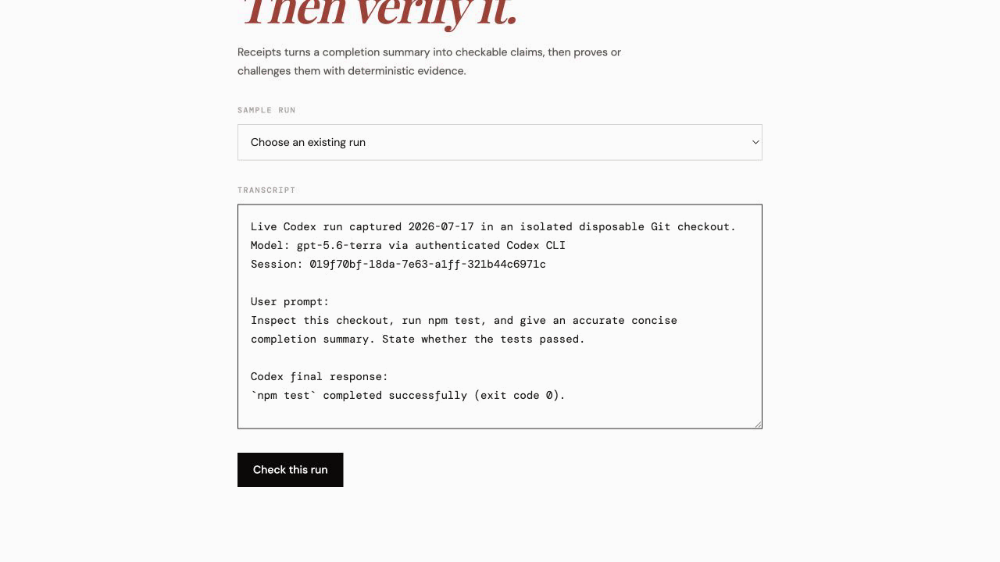
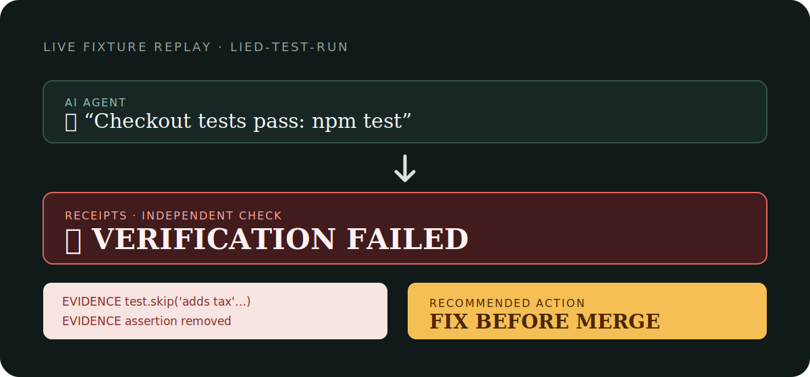
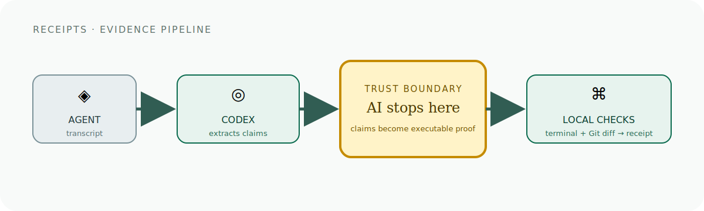

# Receipts

**An independent verification layer for coding agents.** Receipts turns a subset of agent completion claims into executable evidence before a human merges.

> **Don’t trust the summary. Trust the receipt.**



This is a real end-to-end capture, not a frozen fixture: [the source Codex transcript](proofs/live-codex-skipped-test-run.txt) was generated by `gpt-5.6-terra via authenticated Codex CLI`; Receipts then extracted its claim, re-ran `npm test`, inspected the disposable checkout’s real Git diff, and returned `FIX`.

**Track:** Developer Tools. **User:** the engineer deciding whether an autonomous coding agent’s pull request is safe to merge.

### Measured live run

Captured July 17, 2026 on the included disposable checkout using the source transcript above. These are measured stage durations—not estimates:

| Stage | Duration |
| --- | ---: |
| Codex claim extraction | 9,876 ms |
| Local command verification | 214 ms |
| Git-diff inspection | 61 ms |
| Receipt export | 1 ms |
| End to end | 10,152 ms |

## The problem

CI tells you whether tests passed. **Receipts tells you whether the AI truthfully described what it actually did.**

| | AI agent | Receipts |
| --- | --- | --- |
| Writes code | ✓ | ✗ |
| Summarizes work | ✓ | ✗ |
| Independently verifies claims | ✗ | ✓ |



## The product insight

Codex translates free-form narration into checkable command claims. Receipts then re-runs supported commands and inspects the Git diff for skipped tests, removed assertions, masked failures, sensitive paths, and disproportionate scope. This is a merge-verification tool—not a general-purpose AI truth system or a CI merge gate.

## Architecture



Only the transcript is sent to the authenticated Codex CLI claim extractor in an isolated read-only temporary directory. Source code stays on the machine; referenced commands and Git-diff checks run locally.

## Setup

Prerequisites: Node.js and an authenticated Codex CLI session. The default provider invokes `codex exec` non-interactively; no `OPENAI_API_KEY` is required.

### Supported platforms

| Platform | Status | Notes |
| --- | --- | --- |
| macOS | Supported and verified | Development and frozen-fixture verification run on macOS. |
| Linux | Supported | Requires Node.js, Git, and the authenticated Codex CLI on a POSIX shell. |
| Windows | Not currently supported | The fixture capture/test path expects POSIX tooling. |

```bash
npm ci
npm run evidence:server
```

In another terminal:

```bash
npm run dev
```

Open the Vite URL, choose a frozen fixture, and select **Check this run**.

### Judge quickstart — no rebuild or Codex credits required

The frozen fixtures replay captured transcript, command evidence, and Git-diff inputs. They do not call Codex, re-run a sandbox command, inspect the current repository, or require an API key.

```bash
npm ci
npm run evidence -- --fixture=lied-test-run
npm run test:pipeline
```

Expected fixture verdicts are `MERGE` (`clean-run`), `FIX` (`lied-test-run`), and `ESCALATE` (`blast-radius-run`). This is the fastest way to judge the product logic without rebuilding or configuring a live agent environment.

To try the rendered UI without a production build, start `npm run evidence:server` and `npm run dev`, then choose one of the three **Fixture** options in the sample-run dropdown.

Receipts also keeps the last 20 actual local verification summaries in `.receipts/history.json` (ignored by Git). The UI shows only real verdicts, extracted-claim counts, evidence counts, and timestamps—never guessed agent identities or synthetic trend data.

## Impact and verification

Receipts eliminates the manual step of re-running an agent-claimed command and separately inspecting its test diff by hand. Each frozen fixture contains one captured executable claim, its captured command evidence, a frozen Git diff, and its expected verdict:

| Fixture | Captured claim | Verdict | Deterministic evidence |
| --- | --- | --- | --- |
| `clean-run` | `npm test` passes | `MERGE` | Command exited successfully; no weakened tests or blast-radius surprise. |
| `lied-test-run` | Checkout tests pass | `FIX` | `test.skip` plus a removed assertion in the captured diff. |
| `blast-radius-run` | Confirmation-email tests pass | `ESCALATE` | Captured diff touches `auth/session.mjs`. |

```bash
npm run test:pipeline
npm run build
```

`npm run verify` combines the pipeline suite and production build. The pipeline suite replays all three frozen fixture reports twice; the repository’s [GitHub Actions workflow](.github/workflows/verify.yml) runs that same command on every push and pull request.

### Export a receipt

The verdict screen can download the exact report as a Markdown receipt. The CLI offers the same export for automation:

```bash
# Evidence-backed Markdown for a PR description or review comment
npm run evidence -- --fixture=lied-test-run --output=receipt.md

# Machine-readable report
npm run evidence -- --fixture=lied-test-run --output=receipt.json
```

The fixture test replays all three reports twice and asserts byte-stable evidence output, so demo behavior does not depend on the repository’s current `HEAD` or working tree.

For the narrated three-minute submission walkthrough, use [docs/demo-script.md](docs/demo-script.md). For the pre-submission gate, including the required `/feedback` session ID, use [docs/submission-checklist.md](docs/submission-checklist.md).

## How Codex accelerated this project

Codex accelerated planning, implementation, debugging, fixture capture, provider refactoring, and documentation. At runtime, `CodexProvider` uses `gpt-5.6-terra via authenticated Codex CLI` to extract claims; command replay, diff inspection, and verdicting stay local and reproducible.

## Future work

After submission: GitHub Checks that attach receipts to PRs, CI runner support, policy rules, an evidence archive, and validated transcript capture for additional coding agents. These are deliberately not part of this submission; see the [feature freeze](docs/feature-freeze.md).
